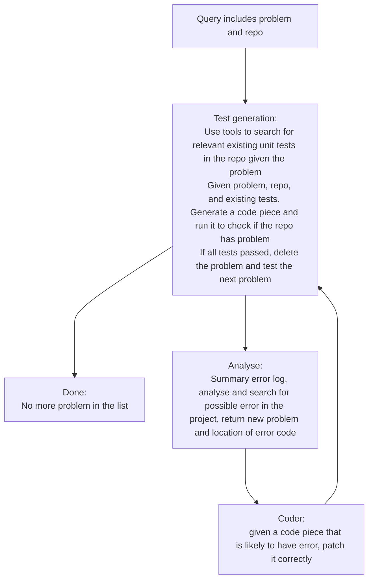

# SCoT
Topological software agent

Create and solve new problem:
- main problem (m) -> test -> failed  
[m]
- create mini problem 1 -> solve -> test -> failed  
[m, m1]
- create mini problem 2 -> solve -> test -> failed  
[m, m1, m2]
- create mini problem 3 -> solve -> test -> ok -> m2 -> ok -> m1 -> ok -> m -> failed  
[m]
- create mini problem 4 -> solve -> test -> ok -> m -> ok  
[]
- empty -> no more problem -> done  